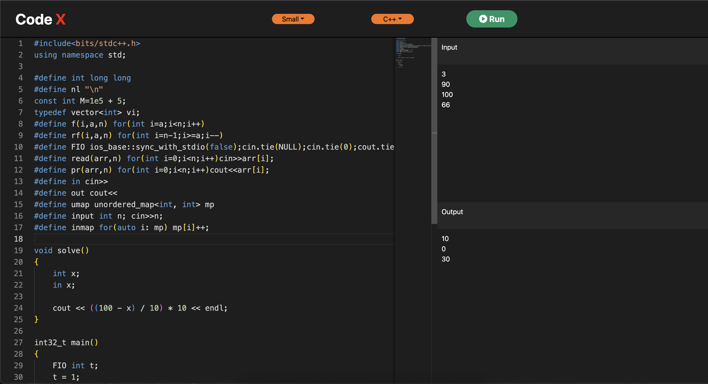

# CodeX

Online coding platform build with support of all major languages. Built with ReactJs, and Monacco Editor, it is fast and reliable.

### Tools used:

**Frontend**: ReactJs \
**Backend**: Rapid API (Judge 0) \
**Editor**: Monacco Editor

## Installation

Install the project with npm

```bash
  git clone https://github.com/shyamal2411/codex
  cd codex
```

Install dependencies

```bash
npm install && npm start
```

## API Reference

CodeX uses Judge0 API by Rapid API for code compilation.

**Steps for starting the backend**

Step 1: Visit [Judge0](https://rapidapi.com/judge0-official/api/judge0-ce/pricing) and subscribe to Basic plan.

Step 2: Navigate to [Endpoints](https://rapidapi.com/judge0-official/api/judge0-ce) tab and subscribe to `create Submission` API.

Step 3: Get the `X-RapidAPI-Key` and `X-RapidAPI-Host` from the sample code and paste it in example .env file.

#### Get all languages to get Language Id

```http
  GET /languages/
```

| Parameter         | Type     | Description           |
| :---------------- | :------- | :-------------------- |
| `X-RapidAPI-Key`  | `string` | **Required**. API key |
| `X-RapidAPI-Host` | `string` | **Required** Host key |

## Demo


